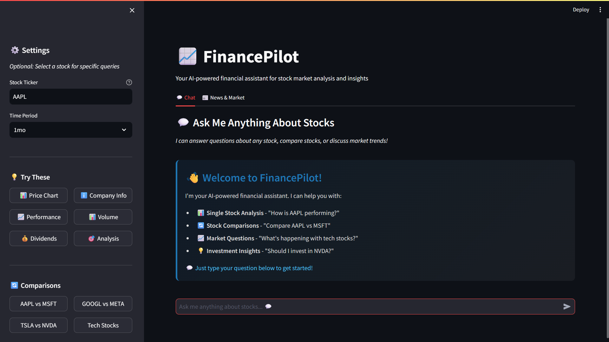
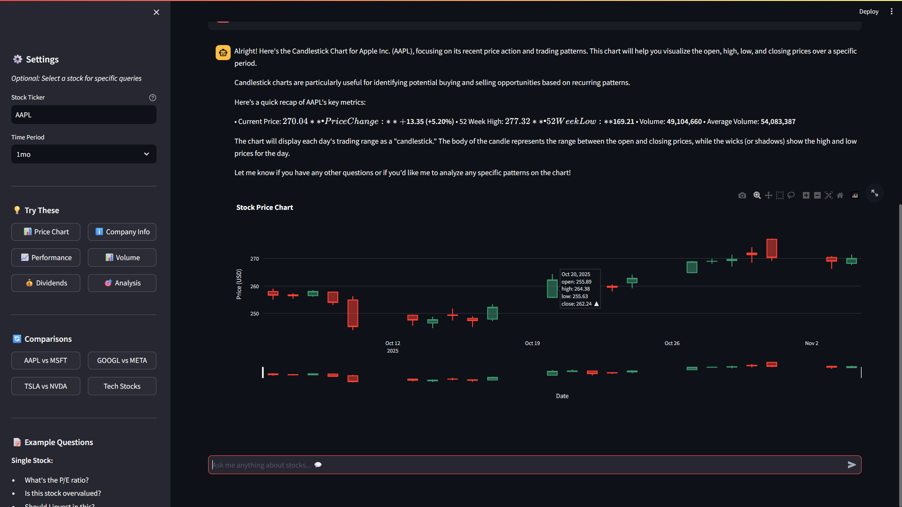
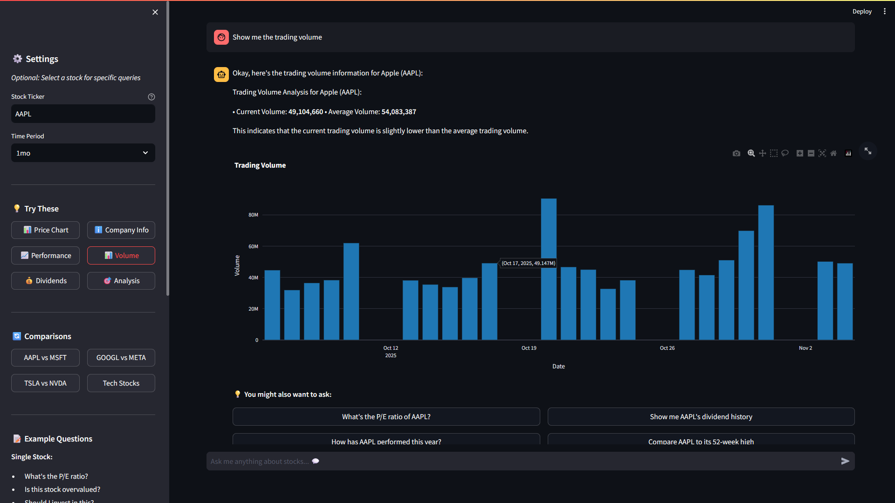
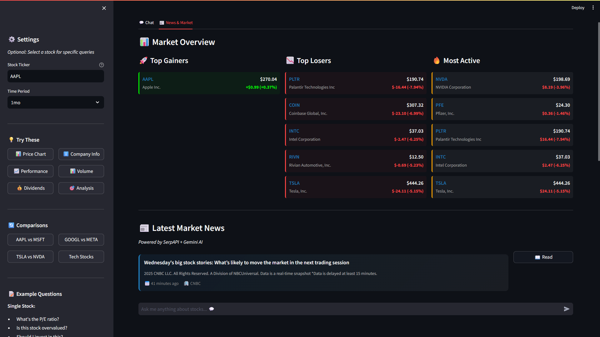

# FinancePilot 📈

> Your AI-powered co-pilot for navigating the stock market

FinancePilot is an intelligent financial assistant that combines real-time stock data, AI-powered analysis, and semantic search to help you make informed investment decisions. Ask questions in plain English, compare stocks, get the latest news, and visualize market trends—all in one place.


## 📸 Screenshots

<div align="center">

### Chat Interface

*Natural language interface with AI-powered suggestions*

### Candlestick Chart Analysis

*Interactive candlestick charts with detailed metrics*

### Volume Analysis

*Trading volume visualization with AI insights*

### Market Overview with News

*Real-time market data with top gainers, losers, most active stocks, and latest news*

</div>

## 🎯 What is FinancePilot?

FinancePilot transforms how you interact with stock market data. Instead of navigating complex financial platforms or writing code to analyze stocks, simply ask questions in natural language:

- **"How has Apple performed this year?"** → Get detailed analysis with interactive charts
- **"Compare Tesla vs Ford"** → See side-by-side performance metrics
- **"What's the latest news on Microsoft?"** → Get AI-summarized news articles
- **"Show me a scatter plot of AAPL vs GOOGL"** → Visualize stock correlations

## ✨ Key Features

### 🤖 Natural Language Understanding
Powered by **Google Gemini 2.0 Flash**, FinancePilot understands context and intent:
- Ask questions conversationally, no special syntax needed
- Automatically detects what chart type best answers your question
- Provides formatted responses with bullet points and clear metrics
- Suggests relevant follow-up questions

### 📊 Dynamic Visualizations
**Single Stock Analysis:**
- **Candlestick Charts** - OHLC data for technical analysis
- **Line Charts** - Clean price trends over time
- **Volume Analysis** - Trading volume patterns
- **Dividend History** - Track dividend payments

**Multi-Stock Comparisons:**
- **Price Comparison** - Overlay multiple stock prices
- **Performance Comparison** - Normalized % change from start
- **Volume Comparison** - Compare trading activity
- **Metrics Comparison** - P/E ratios, market cap, dividends
- **Scatter Plots** - Visualize correlations between stocks
- **Correlation Heatmaps** - Matrix view of multiple stock relationships

### 📰 Real-Time Market Intelligence
- **Live News Feed** - Latest financial news from SerpAPI
- **AI Summaries** - Gemini-powered article summaries (batch processed for speed)
- **Market Overview** - Top gainers, losers, and most active stocks
- **Source Attribution** - Know where information comes from

### 🔍 RAG (Retrieval-Augmented Generation)
Advanced semantic search using OpenSearch vector database:
- **Vector Embeddings** - Sentence transformers (all-MiniLM-L6-v2)
- **Hybrid Search** - Combines vector similarity + keyword matching
- **Context-Aware Responses** - Retrieves relevant historical data
- **Conversation Memory** - Stores and searches chat history

### ⚡ Performance Optimizations
- **98% Faster** - Intelligent caching reduces response times from 15-25s to 276ms
- **5-Minute Cache** - In-memory caching for frequently accessed data
- **Batch Processing** - Efficient AI usage for news summarization
- **Lazy Loading** - News/market data loads only when needed
- **Smart API Usage** - Minimizes unnecessary Gemini API calls

## 🏗️ Architecture

```
FinancePilot/
├── backend/
│   ├── main.py                    # FastAPI server (1177 lines)
│   │   ├── /query                 # Main NLP query endpoint
│   │   ├── /chat                  # General chat endpoint
│   │   ├── /market-overview       # Top gainers/losers/active
│   │   ├── /fetch-article         # Article extraction & summarization
│   │   ├── /rag-query             # RAG-enabled Q&A
│   │   ├── /search-news           # Vector similarity search
│   │   └── /opensearch-status     # DB health check
│   │
│   ├── opensearch_client.py       # Vector DB client
│   │   ├── OpenSearchVectorDB     # Main class
│   │   ├── create_index()         # Index management
│   │   ├── embed_text()           # Text → vector embeddings
│   │   ├── index_document()       # Store documents
│   │   ├── search_similar()       # Vector search
│   │   └── hybrid_search()        # Vector + keyword search
│   │
│   ├── requirements.txt           # Backend dependencies
│   └── .env                       # API keys (not in git)
│
├── frontend/
│   ├── app.py                     # Main Streamlit app
│   │   ├── Tab 1: Chat            # Conversational interface
│   │   └── Tab 2: News & Market   # News feed + market overview
│   │
│   ├── components/
│   │   ├── chat_interface.py     # Chat UI & message handling
│   │   ├── sidebar.py            # Stock selector & quick actions
│   │   ├── news_feed.py          # News display with summaries
│   │   ├── market_overview.py    # Gainers/losers/active stocks
│   │   └── charts.py             # All chart generation functions
│   │
│   └── requirements.txt          # Frontend dependencies
│
├── .gitignore                     # Excludes .env, *.md except README
├── .env.example                   # Template for environment variables
└── README.md                      # This file
```

## 🚀 Quick Start

### Prerequisites
- Python 3.8 or higher
- pip (Python package manager)
- Google Gemini API key (required)
- SerpAPI key (optional, for news)
- Docker (optional, for OpenSearch/NocoDB)

### Step 1: Clone the Repository
```bash
git clone https://github.com/adityapawar327/FinancePilot.git
cd FinancePilot
```

### Step 2: Install Dependencies

**Backend:**
```bash
cd backend
pip install -r requirements.txt
```

**Frontend:**
```bash
cd frontend
pip install -r requirements.txt
```

### Step 3: Configure API Keys

Create `backend/.env` file:
```env
# Required - Get from https://makersuite.google.com/app/apikey
GEMINI_API_KEY=your_gemini_api_key_here

# Optional - Get from https://serpapi.com/manage-api-key
SERPAPI_API_KEY=your_serpapi_key_here

# Optional - OpenSearch for RAG (if running locally)
OPENSEARCH_HOST=localhost
OPENSEARCH_PORT=9200
OPENSEARCH_USER=admin
OPENSEARCH_PASSWORD=Admin@123

# Optional - NocoDB for query history
NOCODB_API_TOKEN=your_nocodb_token
NOCODB_TABLE_ID=your_table_id
NOCODB_BASE_URL=http://localhost:8080
```

### Step 4: Run the Application

**Terminal 1 - Start Backend:**
```bash
cd backend
python main.py
```
✅ Backend running at `http://localhost:8000`

**Terminal 2 - Start Frontend:**
```bash
cd frontend
streamlit run app.py
```
✅ Frontend opens automatically at `http://localhost:8501`

### Step 5: Start Using FinancePilot!
1. Enter a stock ticker (e.g., AAPL, GOOGL, MSFT) in the sidebar
2. Select a time period (1 week to 5 years)
3. Ask questions in the chat interface
4. Explore the News & Market tab for latest updates

## 📖 Usage Guide

### Basic Queries
```
"Show me the price chart"
"What's the current price?"
"Tell me about this company"
"What sector is Apple in?"
```

### Analysis & Insights
```
"How has this stock performed this year?"
"Is this stock overvalued?"
"Give me a detailed analysis"
"What's the P/E ratio?"
"Compare to the 52-week high"
"How volatile is this stock?"
```

### Stock Comparisons
```
"Compare AAPL vs GOOGL"
"Show performance comparison with MSFT and TSLA"
"Compare Tesla vs Ford vs GM"
"Which is better: AAPL or MSFT?"
```

### Advanced Visualizations
```
"Show me a scatter plot of AAPL vs GOOGL"
"Create a correlation heatmap for AAPL, MSFT, GOOGL"
"Show volume comparison between TSLA and F"
"Display metrics comparison for tech stocks"
```

### News & Market
```
"What's the latest news about Tesla?"
"Summarize recent developments"
"Show me market overview"
"What are the top gainers today?"
```

## 🔧 Advanced Setup (Optional)

### OpenSearch for RAG
OpenSearch enables semantic search and conversation memory:

```bash
docker run -d \
  -p 9200:9200 \
  -p 9600:9600 \
  -e "discovery.type=single-node" \
  -e "OPENSEARCH_INITIAL_ADMIN_PASSWORD=Admin@123" \
  opensearchproject/opensearch:latest
```

**What it does:**
- Stores news articles with vector embeddings
- Enables semantic search ("find articles about AI stocks")
- Stores conversation history for context-aware responses
- Uses sentence-transformers (all-MiniLM-L6-v2) for embeddings

**Indices created automatically:**
- `news_articles` - News with summaries and embeddings
- `stock_data` - Historical stock information
- `chat_history` - Conversation memory

### NocoDB for Query History
NocoDB stores all your queries for later reference:

```bash
docker run -d \
  --name nocodb \
  -p 8080:8080 \
  nocodb/nocodb:latest
```

**Setup:**
1. Open http://localhost:8080
2. Create a new table with these fields:
   - `question` (SingleLineText)
   - `ticker` (SingleLineText)
   - `timestamp` (DateTime)
   - `response` (LongText)
3. Get API token from Settings → API Tokens
4. Get table ID from the URL when viewing the table
5. Add to `backend/.env`

## 🛠️ API Reference

### Core Endpoints

#### `POST /query`
Main endpoint for stock queries with natural language.

**Request:**
```json
{
  "question": "How has Apple performed this year?",
  "ticker": "AAPL",
  "period": "1y",
  "compare_tickers": ["GOOGL", "MSFT"]  // optional
}
```

**Response:**
```json
{
  "answer": "Apple (AAPL) has shown strong performance...",
  "data": {
    "dates": ["2024-01-01", "2024-01-02", ...],
    "close": [150.25, 152.30, ...]
  },
  "chart_type": "candlestick",
  "suggestions": [
    "What's the P/E ratio of AAPL?",
    "Show me AAPL's dividend history"
  ]
}
```

#### `POST /chat`
General conversation endpoint (no ticker required).

**Request:**
```json
{
  "question": "What is a P/E ratio?"
}
```

**Response:**
```json
{
  "answer": "P/E ratio (Price-to-Earnings) is...",
  "needs_ticker": false,
  "suggestions": ["Tell me about AAPL", "Show me TSLA stock"]
}
```

#### `GET /market-overview`
Get top gainers, losers, and most active stocks.

**Response:**
```json
{
  "gainers": [
    {"ticker": "NVDA", "name": "NVIDIA", "price": 450.25, "change_pct": 5.2}
  ],
  "losers": [...],
  "active": [...]
}
```

#### `POST /rag-query`
RAG-enabled question answering with context retrieval.

**Request:**
```json
{
  "question": "What's happening with AI stocks?",
  "k": 5  // number of context articles to retrieve
}
```

**Response:**
```json
{
  "answer": "Based on recent news, AI stocks...",
  "sources": [
    {"title": "...", "url": "...", "source": "..."}
  ],
  "context_used": true
}
```

### Chart Types
The system automatically selects the best chart type based on your question:

- `candlestick` - OHLC data, price action
- `line` - Simple price trends
- `volume` - Trading volume analysis
- `bar` - Dividend history
- `comparison` - Multiple stock prices
- `performance_comparison` - Normalized % change
- `volume_comparison` - Volume across stocks
- `metrics_comparison` - P/E, market cap, etc.
- `scatter` - Correlation between two stocks
- `heatmap` - Correlation matrix
- `none` - No chart needed (info queries)

## 🧪 How It Works

### 1. Natural Language Processing
```python
User: "Compare Apple vs Microsoft performance"
  ↓
Gemini 2.0 Flash analyzes intent
  ↓
Detects: comparison request, 2 tickers, performance focus
  ↓
Selects chart type: "performance_comparison"
```

### 2. Data Fetching
```python
yfinance.Ticker("AAPL").history(period="1mo")
  ↓
Fetches: OHLC, volume, dividends, company info
  ↓
Caches for 5 minutes (in-memory)
```

### 3. AI Analysis
```python
Context = stock data + recent news + user question
  ↓
Gemini generates structured response
  ↓
Formats with bullet points, metrics, insights
```

### 4. Visualization
```python
Plotly creates interactive chart
  ↓
Streamlit renders in browser
  ↓
User can zoom, pan, hover for details
```

### 5. RAG Enhancement (Optional)
```python
User question → Sentence Transformer → Vector embedding
  ↓
OpenSearch hybrid search (vector + keyword)
  ↓
Retrieves top 5 relevant articles/conversations
  ↓
Adds context to Gemini prompt
  ↓
More informed, contextual response
```

## 📊 Performance Metrics

### Response Times
- **First query**: 2-5 seconds (fetches data, generates response)
- **Cached query**: 276ms (98% faster)
- **News loading**: 3-8 seconds (fetches + summarizes 10 articles)
- **Cached news**: Instant (5-minute TTL)

### Optimization Techniques
1. **In-Memory Caching** - 5-minute TTL for stock data and news
2. **Batch Processing** - Summarize multiple articles in one AI call
3. **Lazy Loading** - News tab loads only when clicked
4. **Smart Indexing** - Skip re-indexing existing documents in OpenSearch
5. **Conditional RAG** - Only use vector search when OpenSearch is available

### API Usage
- **Gemini API**: ~1-3 calls per query (depending on complexity)
- **Yahoo Finance**: 1 call per stock (cached for 5 minutes)
- **SerpAPI**: 1 call per news refresh (cached for 5 minutes)

## 🔒 Security & Privacy

### API Key Protection
- All API keys stored in `.env` file (not in git)
- `.gitignore` excludes all `.env` files
- `.env.example` provides template with placeholders
- No hardcoded credentials in source code

### Data Privacy
- No user data stored without explicit configuration (NocoDB)
- OpenSearch runs locally (optional)
- All data processing happens on your machine
- No third-party analytics or tracking

## 🤝 Contributing

Contributions are welcome! Here are some ideas:

**Features:**
- Add more chart types (treemaps, sunburst, etc.)
- Support for crypto currencies
- Portfolio tracking and analysis
- Technical indicators (RSI, MACD, Bollinger Bands)
- Backtesting capabilities

**Improvements:**
- Better error handling
- Unit tests
- Docker Compose setup
- CI/CD pipeline
- Mobile-responsive UI

## 📝 License

MIT License - feel free to use this project for personal or commercial purposes.

## 🙏 Acknowledgments

Built with these amazing technologies:
- **Google Gemini 2.0 Flash** - AI language model
- **FastAPI** - Modern Python web framework
- **Streamlit** - Rapid UI development
- **Plotly** - Interactive visualizations
- **yfinance** - Yahoo Finance data
- **OpenSearch** - Vector database
- **SerpAPI** - News aggregation
- **sentence-transformers** - Text embeddings

## 📧 Contact

Created by [Aditya Pawar](https://github.com/adityapawar327)

Repository: [https://github.com/adityapawar327/FinancePilot](https://github.com/adityapawar327/FinancePilot)

---

**⭐ If you find FinancePilot useful, please star the repository!**
